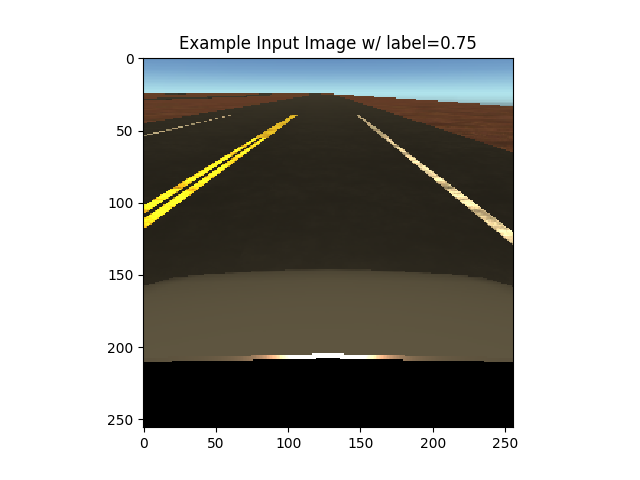
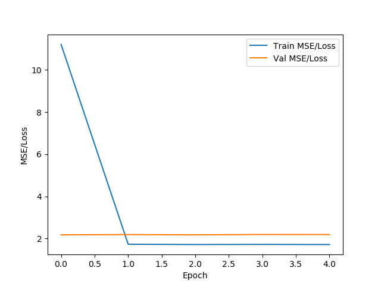

# Part 2 - Convolutional Neural Network
## Summary
Using data generated from our RL agent, we train a CNN to take an image from a camera set at the front of the vehicle
and map that input to a wheel angle in which the vehicle should turn next.

## Architecture
Can use [PlotNeuralNet](https://github.com/HarisIqbal88/PlotNeuralNet) to visualize architecture.

## Current State
#### Input Example:

#### Loss:

