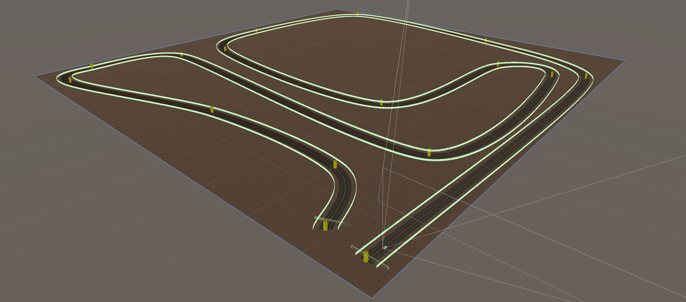
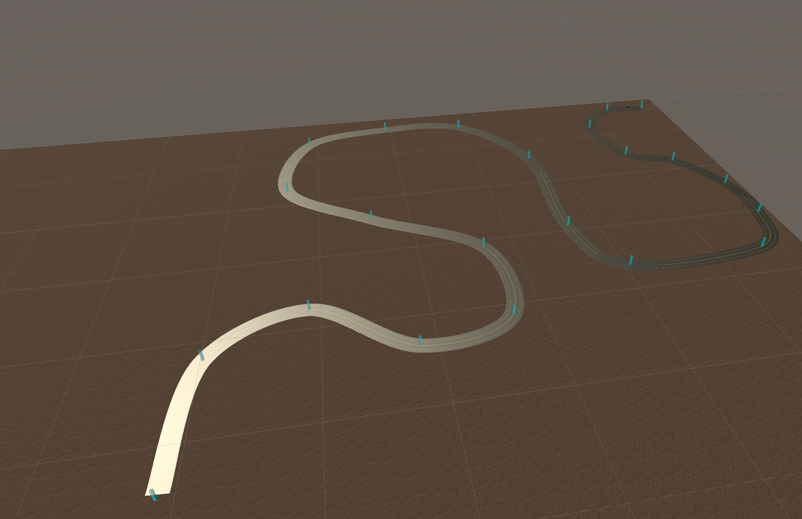
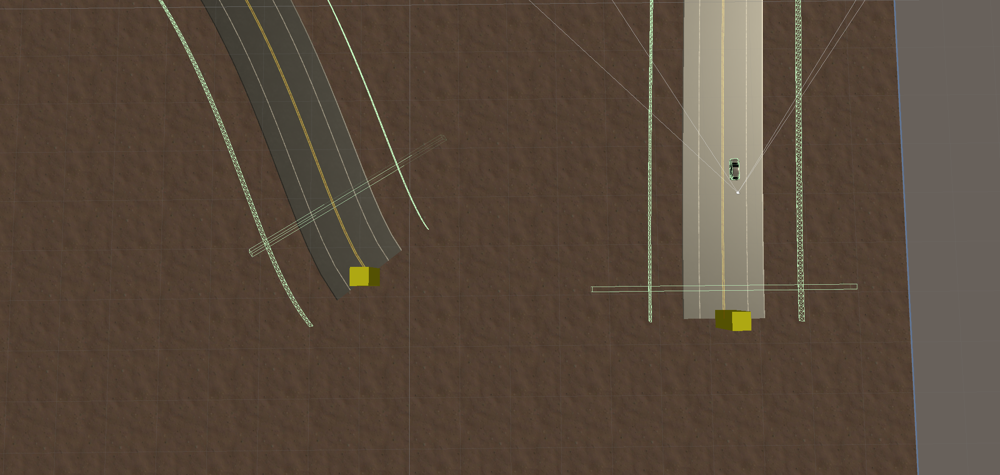

# Simulation Environment

## Road 01:
For the initial road we developed a track that captures a good representation of turns and straightaways. First allowing the vehicle to learn a straight path then a simple left turn, followed by a mixture of turns with different degrees. 
* Scene: `road001`
* Distance: `5882.7m`
* Lane Width: `5m`
* Shoulder Width: `3m`
* Road Material: `Asphalt`
* Lane Guides Distance from Center: `15m`
* Lane Guides Distance from Edge of Road: `8m`

 

## Road 02:
For the initial road we developed a track that captures a good representation of turns and straightaways. First allowing the vehicle to learn a straight path then a simple left turn, followed by a mixture of turns with different degrees. 
* Scene: `curve`
* Distance: `2106.0m`
* Lane Width: `5m`
* Shoulder Width: `3m`
* Road Material: `Asphalt`
* Lane Guides Distance from Center: `15m`
* Lane Guides Distance from Edge of Road: `8m`

 

## Lane Guides
Using Road Architects edge objects, we constructed a invisible walls that run the entire length of the road. These wall are collision boxes that are note rendered. Physically, the car cannot leave the inclosed road area. These guides are used with the reinforcement learning model to determine the vehicles position using ray casts extending from the wheels. The goal is that these walls can be removed when the CNN model is trained.

## Start and End Boxes
The start and end boxes are collision meshes that are not rendered. They mark the start and stop areas of the road. The start box is only used for containment, but the end box determines the end of a reinforcement learning episode.

 