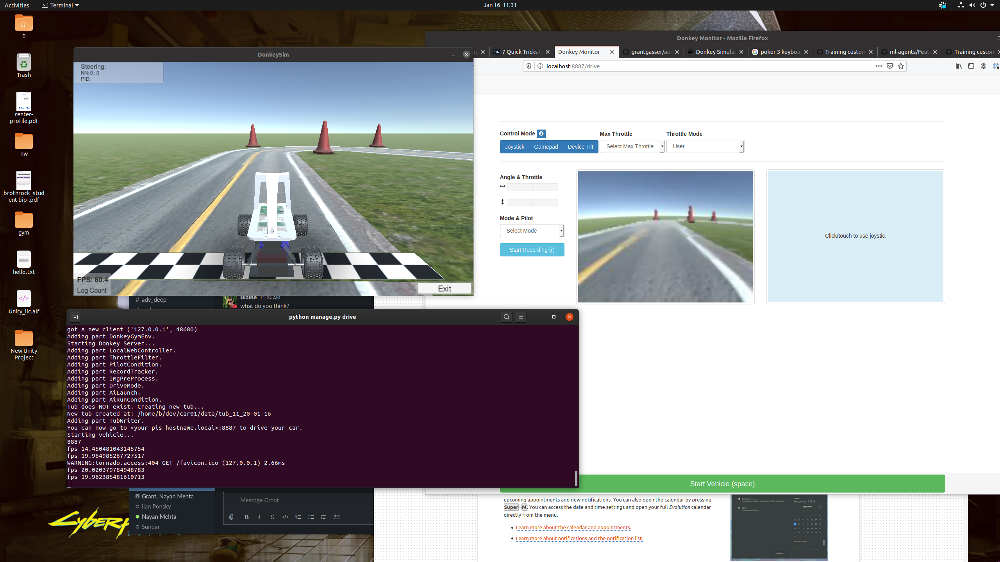

# DonkeyCar Exploration

[Donkey Car](https://www.donkeycar.com/) is a open source DIY driving platform. We are interested  in the simulation platform which supports training neural networks with Keras to drive on track environments built in Unity. To start exploring this project and we first followed [this](https://docs.donkeycar.com/guide/simulator/) tutorial in the official Donkey Car documentation.

Installation was fairly simple, requiring first [Donkey Car Gym](https://github.com/tawnkramer/gym-donkeycar/releases) and the [Donkey Car Host](https://docs.donkeycar.com/guide/install_software/#step-1-install-software-on-host-pc) software (we do not have a physical Donkey Car). After installation we created a [instance of car]() on our local machine. We are using a Ubuntu machine with GPU capability. We did not alter the default settings. In order to use Donkey Car Gym we need the [simulator](https://github.com/tawnkramer/sdsandbox/tree/donkey), which is another repo not directly related to the Donkey project. The simulator runs a standalone application. With everything installed the web GUI can be ran using `python manage.py drive`. This GUI can operate the car and record data for training.

Driving the car is difficult without a controller or joystick, so for exploration we used the provided [test data](https://drive.google.com/open?id=1A5sTSddFsf494UDtnvYQBaEPYX87_LMp). The driving data is a series of image that are passed through a CNN and the goal is to learn the course and stay in the lines. Using the default configuration we were able to train a linear model on GPU.

## Simulator & Unity Project Concerns
Getting the simulator up and running was relatively simple, so we spent some time looking at the unity project to see if we could potentially alter the environments. Unfortunately, the simulator hasn't been updated and requires a older version of Unity (version 5), even with downloading the version we were not able to open the project in order to edit. This is problematic because the simulation environment is limited.

Without any updates the simulator is really only good training the car to dive in the lines. The environment doesn't have high quality renderings, or realistic environments minus the road itself. Alterations to the simulator would need to be made to improve the training process. Training the car to stay in the lines proves simple (100 epochs of about 30 laps of training data).

## Conclusion

The simulator and gym projects are working and provide a decent amount of flexibility with training including RNN, but the simulator is limited in that it only uses the camera and cannot be updated (at least without some effort). A possibility is to purchase a Donkey Car and construct physical environments for training. It could be interesting to add additional components to car for more training data, for example [LiDAR](https://www.hackster.io/bluetiger9/stereo-vision-and-lidar-powered-donkey-car-575769). The Donkey Car project is extendable and active, but the simulation environment not well supported. Before committing to this we would will explore other projects that do not require physical components.